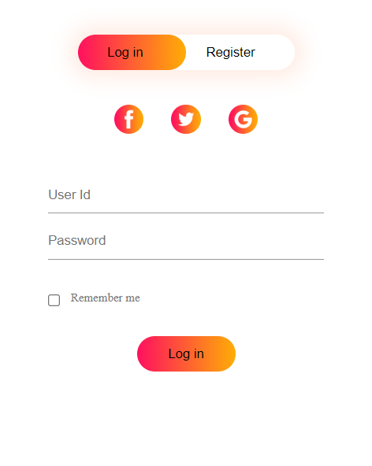
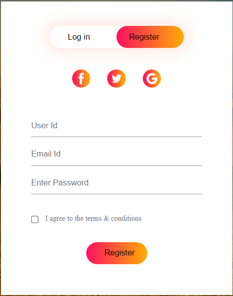

# 🌿 Pasugaaram — The Organic Evolution

[](https://nodejs.org/)
[](https://expressjs.com/)
[](https://opensource.org/licenses/MIT)

Pasugaaram is a premium, animated, responsive **full-stack e-commerce web platform** designed to bring 100% pure, farm-fresh organic agricultural produce directly to consumers. Sourced from certified local partner farms, Pasugaaram facilitates a healthy organic lifestyle by offering raw fruits, vegetables, unprocessed honey, A2 dairy, natural spices, bio-fertilizers, and cold-pressed juices.

---

## 📝 Table of Contents
- [✨ Key Features](#-key-features)
- [⚙️ Tech Stack](#️-tech-stack)
- [📚 Project Architecture](#-project-architecture)
- [🚀 Quick Start & Installation](#-quick-start--installation)
- [📡 Backend API Documentation](#-backend-api-documentation)
- [🖼️ User Interface & Design Aesthetics](#️-user-interface--design-aesthetics)
- [✍️ Authors & Acknowledgments](#️-authors--acknowledgments)

---

## ✨ Key Features

### 🎨 Premium Frontend Experience
- **Modern Glassmorphic UI**: Clean HSL forest green accents with backdrop blur cards, custom scrollbar, and polished typography.
- **Micro-Animations**: Hover animations on category flip-cards, animated stats counters, scroll reveal effects, and animated falling leaves on the hero banner.
- **Dynamic Product Catalogs**: Dynamic search inputs and criteria sorting (by price/rating) for each category.
- **Reactive Shopping Cart**: Dynamic cart totals, GST calculations, coupon code discount checks, and quantity update controls stored securely in `localStorage`.
- **Toast Notifications**: Smooth slide-in overlay notifications for cart and auth feedback actions.

### 🔌 Fully-Featured REST Backend
- **User Authentication**: Secure register and login systems using **bcryptjs** password hashing and **JSON Web Tokens (JWT)** for session validation.
- **Order Placement Flow**: Checkout address validations with delivery tracking estimates.
- **Data Persistence**: Local database files for users, orders, and product catalogs.

---

## ⚙️ Tech Stack

- **Frontend**: HTML5, Vanilla JavaScript (ES6+), CSS3 (Modern custom variables, grid structures, keyframe animations), Font Awesome v6 Icons.
- **Backend**: Node.js, Express.js.
- **Libraries**:
  - `bcryptjs` — Cryptographic secure password hashing.
  - `jsonwebtoken` — Authorization session validation.
  - `uuid` — Distinct unique ID generator.
  - `cors` — Cross-Origin resource sharing support.

---

## 📚 Project Architecture

```
├── server.js                   # Node.js Express REST API Entry Point
├── package.json                # Project dependencies and running scripts
├── style.css                   # Responsive layout stylesheet & design system
├── script.js                  # Frontend controllers, cart logic & auth client
├── data/                       # Local JSON database files
│   ├── products.json           # Farm products catalog
│   ├── users.json              # Hashed user records
│   └── orders.json             # Placed order logs
├── index.html                  # Responsive home page with slides and categories
├── about.html                  # Story, team timeline and visions
├── login.html                  # Register & Log In glassmorphism form
├── cart.html                   # Cart details with totals and coupons
├── checkout.html               # New Checkout page for order placement
├── profile.html                # New User profile page and order history logs
├── faq.html                    # Interactive animated FAQ accordion
├── policy.html                 # Privacy policy declarations
├── terms&conditions.html       # Legal policies agreement
├── images/                     # System assets & banner graphics
└── screenshot/                 # Interface capture collections
```

---

## 🚀 Quick Start & Installation

### Prerequisites
- Make sure [Node.js](https://nodejs.org/) (version 18 or higher) is installed on your computer.

### Step 1: Install Dependencies
Open your command terminal inside the project directory and run:
```bash
npm install
```

### Step 2: Start the Web Server
Launch the server using Node:
```bash
npm start
```
Alternatively, for development environments with auto-reload features:
```bash
npm run dev
```

### Step 3: Run the Application
The console will log the server address:
```
╔═══════════════════════════════════════╗
║   🌿 Pasugaaram Server Running        ║
║   http://localhost:3000               ║
║   The Organic Evolution               ║
╚═══════════════════════════════════════╝
```
Open **[Pasugarram.com](https://darkmatri.github.io/Pasugarram-2/)** in any modern web browser to explore.

---

## 📡 Backend API Documentation

All API communications send and receive `application/json` payload bodies.

### Authentication Endpoints
- **POST** `/api/auth/register` — Registers a new user.
  - Body: `{ "name", "email", "password", "phone" }`
- **POST** `/api/auth/login` — Authenticates user, returns JWT.
  - Body: `{ "email", "password" }`
- **GET** `/api/auth/me` — Fetches current logged-in profile.
  - Headers: `Authorization: Bearer <JWT_TOKEN>`

### Products Catalog Endpoints
- **GET** `/api/products` — Returns entire catalog.
- **GET** `/api/products/:category` — Returns items within specific categories (e.g. `fruits`, `vegetables`, `honey`, `milk`, `spices`, `sauce`, `juice`, `fertilizer`).
- **GET** `/api/product/:id` — Details for a single product.

### Order Processing Endpoints
- **POST** `/api/orders` — Submits a checkout order.
  - Headers: `Authorization: Bearer <JWT_TOKEN>`
  - Body: `{ "items", "address", "paymentMethod", "coupon" }`
- **GET** `/api/orders/my` — Lists all orders placed by the current user.
  - Headers: `Authorization: Bearer <JWT_TOKEN>`

### Coupon Promotions
- **POST** `/api/coupon/validate` — Validates coupon codes.
  - Body: `{ "code" }` (Accepts `ORGANIC10` for 10% off, `FRESH20` for 20% off)

---

## 🖼️ User Interface & Design Aesthetics

### Flowchart System
<p align="center">
  
</p>

### Home Page
<p align="center">
  
</p>

### Login & Register Card
<p align="center">
  
  
</p>

---

## ✍️ Authors & Acknowledgments

- **Lead Developer**: Kannan G
- **Inspirations**: Special gratitude to the open-source community, Skill-Lync teams, and traditional organic farming cooperatives.

---

*🌿 Eat healthy, live organic. Developed with ❤️ by Pasugaaram Developers.*
