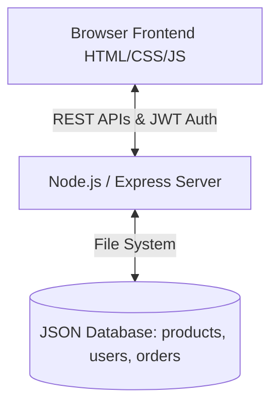

# Pasugaaram — Walkthrough & Summary of Changes

We have successfully transformed the **Pasugaaram** organic e-commerce project from a basic static site into a premium, animated, responsive **full-stack web application**.

---

## 🏗️ Architecture & Enhancements



### 1. Backend REST APIs (`server.js`)
We introduced a Node.js + Express backend running at `http://localhost:3000` with the following endpoints:
- **Product Catalog**: `/api/products` and `/api/products/:category`
- **Authentication**: JWT-token based signup `/api/auth/register` and login `/api/auth/login`
- **Orders**: Secure checkout `/api/orders` and order logs retrieving `/api/orders/my`
- **Promo Codes**: Validate codes `/api/coupon/validate` (supporting `ORGANIC10`, `FRESH20`, `GREEN15`)

### 2. Design System (`style.css`)
- **Aesthetic**: Premium dark-green glassmorphism palette, Outfit typography, custom modern scrollbar.
- **Micro-Animations**: Custom hover rotations on flip cards, scale translations, slide-in toasts, and smooth scroll.
- **Mobile First**: Fluid grids (CSS grid with `auto-fit` / `auto-fill`) adapting seamlessly to 375px up to 1440px wide.

### 3. Frontend Operations (`script.js`)
- **Cart Engine**: Dynamically manages basket quantities in `localStorage`, updates badge counters, triggers success/error notifications, and calculates G.S.T. / coupon discounts.
- **API Client**: Implements asynchronous `fetch` calls, JWT auth state headers, and client-side sorting/filtering lists.
- **UI FX**: Particle generator (falling leaves in hero area) and slideshow timers.

---

## 📂 Project Directory Structure

- `server.js` — Node.js & Express application
- `package.json` — Dependency settings
- `style.css` — Modern glassmorphism responsive theme
- `script.js` — Local cart actions, filters, dynamic lists, auth logic
- `data/`
  - [products.json](file:///d:/kannan%202/html/Pasugarram/data/products.json) — Catalog data for category items
  - [users.json](file:///d:/kannan%202/html/Pasugarram/data/users.json) — User database storage (hashed passwords)
  - [orders.json](file:///d:/kannan%202/html/Pasugarram/data/orders.json) — Order logs database
- `checkout.html` [NEW] — Billing form and final place order flows
- `profile.html` [NEW] — Order histories and user info displays
- `index.html` — Dynamic home with slides, hero animations, and cards
- `cart.html` — Dynamic product summary list, totals, and coupon section
- `login.html` — Register and sign-in handlers
- Category files (`fruits.html`, `vegetables.html`, `honey.html`, `milkproducts.html`, `spice.html`, `sauce.html`, `freshjuice.html`, `fertilizer.html`) — Filterable dynamic product grids

---

## ⚡ How to Verify

1. Run the Express backend server:
   ```bash
   node server.js
   ```
2. Navigate to `http://localhost:3000` in your web browser.
3. Register a new user at the **Log-in** page, add organic items to your cart, apply coupon code `ORGANIC10`, fill in shipping details at Checkout, and view your records on the Profile page.
